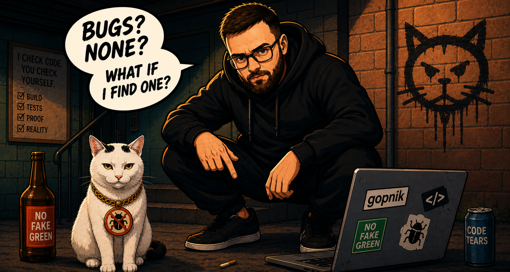

<p align="right"><strong>English</strong> · <a href="README.ru.md">Русский</a></p>

<p align="center">
  
</p>

<p align="center">
  <a href="https://github.com/concordloom/gopnik/actions/workflows/ci.yml"></a>
  <a href="LICENSE"></a>
</p>

# Gopnik

> **Your coding agent says it works. Gopnik tries to prove it doesn't.**

Gopnik is an adversarial verification skill for coding agents. It attacks the
claim that a change is done, checks the delivered revision—not just the source
tree—and reports exactly what was and was not proven.

## Install

Paste this into your coding agent:

```text
Install and configure Gopnik. Read the complete raw guide without saving it to a file, then follow it exactly:
https://raw.githubusercontent.com/concordloom/gopnik/main/docs/install.md
```

The guide asks for your language and install scope, then configures the project
one step at a time. [Upgrading from a release before 4.0?](docs/migration-v4.md)

## Run it

Finish a change, then tell your agent:

```text
Run the gopnik skill on this change.
```

Gopnik does not stop at “tests pass”:

- **Stage 0** names the behaviour the change could have broken.
- **Stage 1** attacks the code inside the repository.
- **Stage 2** attacks the built or deployed revision where people use it.

It also proves that important checks can fail. A green check that cannot go red
is weak evidence.

## A verdict, not a victory lap

```text
BLOCKER — discounted orders are rounded twice.

Reproduce: POST /orders with {"discount": 0.1}
Observed: 23.94
Expected: 23.95
Verified revision: 8f31c2a

Verdict: NOT READY
```

A `READY` verdict carries the same discipline: verified scope, exact revision,
counterevidence, and anything still not proven. Gopnik narrows the verdict when
the real delivery boundary is unreachable; it never paints missing evidence
green.

## Three skills, one development loop

- `gopnik` attacks a completed change.
- `gopnik-critic` attacks an important claim or proposed solution.
- `gopnik-setup` learns how the current project can be verified.

We recommend building adversarial checks into the development cycle. For
example: use `gopnik-critic` on the task from your tracker, use it again on the
proposed solution, then run `gopnik` before moving the completed task to Done.

## Go deeper

- [How Gopnik works](docs/how-it-works.md)
- [Install and configure](docs/install.md)
- [Uninstall](docs/uninstall.md)
- [The Gopnik skill](plugins/gopnik/skills/gopnik/SKILL.md)
- [The critic](plugins/gopnik/skills/gopnik-critic/SKILL.md)
- [Example configuration](gopnik.example.json)

Gopnik is invoked by an agent; it is not a daemon, hook, or release authority.
Your team decides where its verdict belongs in the workflow.

## Uninstall

Paste this into the agent that has Gopnik installed:

```text
Uninstall Gopnik. Read the complete raw guide without saving it to a file, then follow it exactly:
https://raw.githubusercontent.com/concordloom/gopnik/main/docs/uninstall.md
```

## License

MIT.
